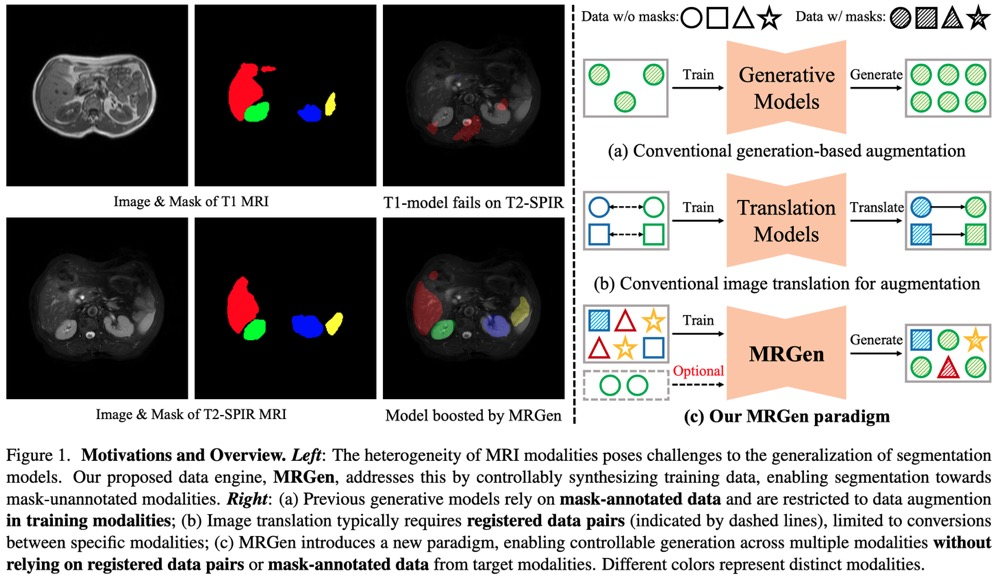

# MRGen: Diffusion-based Controllable Data Engine for MRI Segmentation towards Unannotated Modalities
This repository contains the official PyTorch implementation of MRGen: https://arxiv.org/abs/2412.04106/.

<div align="center">
   
</div>

## Some Information
[Project Page](https://haoningwu3639.github.io/MRGen/) $\cdot$ [Paper](https://arxiv.org/abs/2412.04106/) $\cdot$ [Dataset](https://huggingface.co/datasets/haoningwu/MedGen-1M) $\cdot$ [Checkpoints](https://huggingface.co/haoningwu/MRGen)

## News
- [2025.1] We have released our code, data, and checkpoints.
- [2024.12] Our pre-print paper is released on arXiv.

## Requirements
- Python >= 3.8 (Recommend to use [Anaconda](https://www.anaconda.com/download/#linux) or [Miniconda](https://docs.conda.io/en/latest/miniconda.html))
- [PyTorch >= 2.1.0](https://pytorch.org/)
- xformers == 0.0.27
- diffusers == 0.31.0
- accelerate == 0.17.1
- transformers == 4.46.3
- triton == 2.3.1
- [SAM2](https://github.com/facebookresearch/sam2)

A suitable [conda](https://conda.io/) environment named `MRGen` can be created and activated with:

```
conda env create -f environment.yaml
conda activate MRGen
```

## Dataset
Please check out [MedGen-1M](https://huggingface.co/datasets/haoningwu/MedGen-1M) to download our curated dataset, including two parts: `radiopaedia_data` and `conditional_dataset`.
For the conditional dataset, we have directly provided our processed data, including the raw image, mask annotations, and text descriptions.

As described in our paper, considering the data privacy concerns of [Radiopaedia](radiopaedia.org), we only release the JSON files of this part here.
For each case, the format is represented as `./radiopaedia/{patient_id}/{case_id}/{volume_id}/{slice_id}.jpeg`, for example, `./radiopaedia/2564/1/MRI_4/1.jpeg`.
This format allows you to locate the corresponding original volume through the `link` provided in our json files. 
After obtaining official authorization from Radiopaedia, you may download the data corresponding to the JSON file on your own. 
Alternatively, you can send the authorization via email to us (`haoningwu3639@gmail.com` or `Zhao_Ziheng@sjtu.edu.cn`) to obtain the download link for the image data in our MedGen-1M.


## Training
Our MRGen model requires training in the following three stages.

### Latent Encoding
You can use the `train_vae.py` script to train a VAE for compressing radiology images into latents. 
The model parameters are set in the `./ckpt/vae/config.json` file, and the training hyperparameters can be found in the `./training_configs/train_vae_config.yml` file. 

The training command is as follows:

```
CUDA_VISIBLE_DEVICES=0,1,2,3 python train_vae.py
```

### Text-guided Generation
You need to first download the pre-trained [BiomedCLIP](https://huggingface.co/haoningwu/MRGen/tree/main/text_encoder_BiomedCLIP/) to serve as the text encoder.

You can use the `train_unet.py` script to train a diffusion unet for radiology image synthesis conditioned on text prompt (including modality, modality attributes, region, and organs). 
The model parameters are set in the `./ckpt/unet/config.json` file, and the training hyperparameters can be found in the `./training_configs/train_unet_config.yml` file. 

The training command is as follows:

```
CUDA_VISIBLE_DEVICES=0,1,2,3,4,5,6,7 accelerate launch --main_process_port 12345 train_unet.py
```

### Mask-conditioned Generation
The final mask-conditioned generation training is conducted on different training set pairs and extended to generate on modalities that originally do not have mask annotations.
Therefore, for different dataset pairs, we have different training scripts. 
Here, we use `train_controlnet_CHAOS.py` as an example, where you can set the **source modality** and **target modality** in the data loading part of the code. 
The model parameters are set in the `./ckpt/controlnet/config.json` file, and the training hyperparameters can be found in the `./training_configs/train_controlnet_config.yml` file.

You can find other training scripts in the `./scripts/` directory.

The training command is as follows:

```
CUDA_VISIBLE_DEVICES=0,1,2,3 accelerate launch --main_process_port 23456 train_controlnet_CHAOS.py
```

## Inference

Similar to the previous description, since different mask-conditioned generative models are trained on different dataset pairs, we will only use `synthesize_CHAOS_filter_multi.py` as an example here. 
This script has implemented multi-GPU parallel inference through distributed computing.

You can find other inference scripts in the `./scripts/` directory.

The inference command is as follows:

```
CUDA_VISIBLE_DEVICES=0,1,2,3,4,5,6,7 python synthesize_CHAOS_filter_multi.py --ckpt ./train_controlnet/CHAOS-MRI_T1toT2/ \
 --log_dir ./synthetic_data/CHAOS-MRI_T1toT2 \
 --modality T2-SPIR --channels 1 --sample_per_mask 2 \ 
 --max_tries_per_mask 20 --num_images_per_prompt 10 --num_gpus 8
```

## Evaluation

You can refer to `./scripts/evaluate_vae_performance.py` to evaluate the reconstruction performance of the vae.
Moreover, you can refer to `./scripts/evaluate_diffusion_performance.py` to synthesize radiology images conditioned on text prompts, and utilize [pytorch_fid](https://github.com/mseitzer/pytorch-fid) to calculate FID scores. 
Then `./scripts/evaluate_diffusion_CLIPscore.py` to calculate the CLIP image-image similarity and image-text similarity. 

## Synthetic Data for Segmentation

We take nnU-Net for illustration. So make sure you have [installed nnU-Nets](https://github.com/MIC-DKFZ/nnUNet/blob/e539637821b67893bd57e4ba9dc1e60a218ae3ea/documentation/installation_instructions.md) and [set up your path](https://github.com/MIC-DKFZ/nnUNet/blob/e539637821b67893bd57e4ba9dc1e60a218ae3ea/documentation/setting_up_paths.md) before we start. You first need to transfer the synthetic data to [nnU-Net required format](https://github.com/MIC-DKFZ/nnUNet/blob/e539637821b67893bd57e4ba9dc1e60a218ae3ea/documentation/dataset_format.md?plain=1#L24) with `Segmnetation/prepare_nnunet_data`:
```
python ./Segmnetation/prepare_nnunet_data.py \
--json_file synthetic_data_json_file_path \
--mask2label 'CHAOSMR' --dataset_id '001' --dataset_name 'CHAOSMR_T2_Synthetic'
```
This will create a folder called 'Dataset001_CHAOSMR_T2_Synthetic' under your nnU-Net raw data directory, and get your training data ready. Next, simply follow the [nnU-Net instruction](https://github.com/MIC-DKFZ/nnUNet/blob/e539637821b67893bd57e4ba9dc1e60a218ae3ea/documentation/how_to_use_nnunet.md) to configure and train the segmentation model:
```
nnUNetv2_plan_and_preprocess -d 001 -c 2d

CUDA_VISIBLE_DEVICES=0 nnUNetv2_train 001 2d all -tr nnUNetTrainer --c
```
Now, assume that you have the evaluation data ready as 'Dataset002_CHAOSMR_T2_Real' under your nnU-Net raw data directory (you can refer to `Segmentation/prepare_real_data,py` for how to transfer 3D volumes in these public segmentation datases to 2D png files as nnU-Net raw data), you can run the inference code:
```
CUDA_VISIBLE_DEVICES=0 nnUNetv2_predict
-i /Path_to_your_nnUNet_raw_data_dir/Dataset002_CHAOSMR_T2_Real/imagesTs/ \
-o /Path_to_your_nnUNet_raw_data_dir/Dataset002_CHAOSMR_T2_Real/labelsPred_from_001_synthetic_data/ \
-chk /Path_to_your_nnUNet_result_dir/Dataset001_CHAOSMR_T2_Synthetic/nnUNetTrainer__nnUNetPlans__2d/fold_all/checkpoint_best.pth \
-d 001 \
-c 2d  -f all  --disable_tta
```
Note that even though we synthesize data for 2D segmentation models, the evaluation is done on 3D volumes. To calculate DSC score for the inference result:
```
python ./Segmentation/evaluate_nib.py \
--target_dataset 'CHAOS_MRI' \		# be carefully on the label to intensity mapping
--source_dataset 'CHAOS_MRI' \
--nnunet_name 'Dataset002_CHAOSMR_T2_Real' \
--gt_dir 'labelsTs' \
--seg_dir 'labelsPred_from_001_synthetic_data' \
--img_dir 'imagesTs' 
```

## Checkpoints - Model Zoo
Please refer to [MRGen](https://huggingface.co/haoningwu/MRGen) to download our pre-trained checkpoints.

### Generative Model Checkpoints

| Source Modality | Target Modality | Link |
|:-----------------:|:-----------------:|:------:|
| CHAOS-MRI_T1 | CHAOS-MRI_T2-SPIR | [CHAOS-MRI_T1_to_CHAOS-MRI_T2](https://huggingface.co/haoningwu/MRGen/tree/main/controlnet_model_zoo/controlnet_CHAOS-MRI_T1_to_CHAOS-MRI_T2) |
| CHAOS-MRI_T2-SPIR | CHAOS-MRI_T1 | [CHAOS-MRI_T2_to_CHAOS-MRI_T1](https://huggingface.co/haoningwu/MRGen/tree/main/controlnet_model_zoo/controlnet_CHAOS-MRI_T2_to_CHAOS-MRI_T1) |
| MSD-Prostate_T2 | MSD-Prostate_ADC | [MSDProstate_T2_to_MSDProstate_ADC](https://huggingface.co/haoningwu/MRGen/tree/main/controlnet_model_zoo/controlnet_MSDProstate_T2_to_MSDProstate_ADC) |
| MSD-Prostate_ADC | MSD-Prostate_T2 | [MSDProstate_ADC_to_MSDProstate_T2](https://huggingface.co/haoningwu/MRGen/tree/main/controlnet_model_zoo/controlnet_MSDProstate_ADC_to_MSDProstate_T2) |
| PanSeg_T1 | PanSeg_T2 | [PanSeg_T1_to_PanSeg_T2](https://huggingface.co/haoningwu/MRGen/tree/main/controlnet_model_zoo/controlnet_PanSeg_T1_to_PanSeg_T2) |
| PanSeg_T2 | PanSeg_T1 | [PanSeg_T2_to_PanSeg_T1](https://huggingface.co/haoningwu/MRGen/tree/main/controlnet_model_zoo/controlnet_PanSeg_T2_to_PanSeg_T1) |
| LiQA_T1 | CHAOS-MRI_T2-SPIR | [LiQA_T1_to_CHAOS-MRI_T2](https://huggingface.co/haoningwu/MRGen/tree/main/controlnet_model_zoo/controlnet_LiQA_T1_to_CHAOS-MRI_T2) |
| CHAOS-MRI_T2-SPIR | LiQA_T1 | [CHAOS-MRI_T2_to_LiQA_T1](https://huggingface.co/haoningwu/MRGen/tree/main/controlnet_model_zoo/controlnet_CHAOS-MRI_T2_to_LiQA_T1) |
| MSD-Prostate_ADC | PROMISE12_T2 | [MSDProstate_ADC_to_PROMISE12_T2](https://huggingface.co/haoningwu/MRGen/tree/main/controlnet_model_zoo/controlnet_MSDProstate_ADC_to_PROMISE12_T2) |
| PROMISE12_T2 | MSD-Prostate_ADC | [PROMISE12_T2_to_MSDProstate_ADC](https://huggingface.co/haoningwu/MRGen/tree/main/controlnet_model_zoo/controlnet_PROMISE12_T2_to_MSDProstate_ADC) |
| AMOS22_CT | CHAOS-MRI_T1 | [AMOS22_CT_to_CHAOS-MRI_T2](https://huggingface.co/haoningwu/MRGen/tree/main/controlnet_model_zoo/controlnet_AMOS22_CT_to_CHAOS-MRI_T2) |
| AMOS22_CT | CHAOS-MRI_T2-SPIR | [AMOS22_CT_to_CHAOS-MRI_T1](https://huggingface.co/haoningwu/MRGen/tree/main/controlnet_model_zoo/controlnet_AMOS22_CT_to_CHAOS-MRI_T1) |
| MSD-Liver_CT | CHAOS-MRI_T2-SPIR | [MSDLiver_CT_to_CHAOS-MRI_T2](https://huggingface.co/haoningwu/MRGen/tree/main/controlnet_model_zoo/controlnet_MSDLiver_CT_to_CHAOS-MRI_T2) |

## Citation
If you use this code and data for your research or project, please cite:

	@misc{wu2024mrgen,
            author  = {Wu, Haoning and Zhao, Ziheng and Zhang, Ya and Xie, Weidi and Wang, Yanfeng},
            title   = {MRGen: Diffusion-based Controllable Data Engine for MRI Segmentation towards Unannotated Modalities},
            journal = {arXiv preprint arXiv:2412.04106},
            year    = {2024},
      }

## TODO
- [x] Release Paper
- [x] Release Dataset
- [x] Release Checkpoints
- [x] Code of Training VAE
- [x] Code of Training Diffusion
- [x] Code of Training Controllable Generation
- [x] Code of Training Segmentation
- [x] Code of Inference
- [x] Code of Evaluation


## Acknowledgements
Many thanks to the code bases from [diffusers](https://github.com/huggingface/diffusers) and [SimpleSDM](https://github.com/haoningwu3639/SimpleSDM).


## Contact
If you have any questions, please feel free to contact haoningwu3639@gmail.com or Zhao_Ziheng@sjtu.edu.cn.
