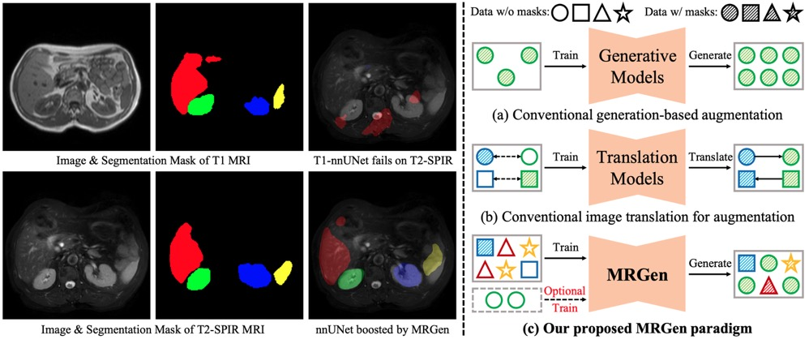

# MRGen: Diffusion-based Controllable Data Engine for MRI Segmentation towards Unannotated Modalities
This repository contains the official PyTorch implementation of MRGen: https://arxiv.org/abs/2412.04106/.

The code, data and checkpoints will be released soon... We are working on that, stay tuned please.

<div align="center">
   
</div>

## Some Information
[Project Page](https://haoningwu3639.github.io/MRGen/)  $\cdot$ [Paper](https://arxiv.org/abs/2412.04106/) $\cdot$ [Dataset]() (Soon) $\cdot$ [Checkpoints]() (Soon) 

## News
- [2024.12] Our pre-print paper is released on arXiv.

## Requirements
- Python >= 3.8 (Recommend to use [Anaconda](https://www.anaconda.com/download/#linux) or [Miniconda](https://docs.conda.io/en/latest/miniconda.html))
- [PyTorch >= 2.1.0](https://pytorch.org/)
- xformers == 0.0.27
- diffusers == 0.31.0
- accelerate == 0.17.1
- transformers == 4.46.3
- triton == 2.3.1

A suitable [conda](https://conda.io/) environment named `MRGen` can be created and activated with:

```
conda env create -f environment.yaml
conda activate MRGen
```

## Train

To be updated soon...

## Inference

To be updated soon...


## Citation
If you use this code and data for your research or project, please cite:

	@misc{wu2024mrgen,
            author  = {Wu, Haoning and Zhao, Ziheng and Zhang, Ya and Xie, Weidi and Wang, Yanfeng},
            title   = {MRGen: Diffusion-based Controllable Data Engine for MRI Segmentation towards Unannotated Modalities},
            journal = {arXiv preprint arXiv:2412.04106},
            year    = {2024},
      }

## TODO
- [x] Release Paper
- [ ] Release Dataset
- [ ] Release Checkpoints
- [x] Code of Training VAE
- [x] Code of Training Diffusion
- [x] Code of Training Controllable Generation
- [ ] Code of Training Segmentation
- [x] Code of Inference
- [x] Code of Evaluation


## Acknowledgements
Many thanks to the code bases from [diffusers](https://github.com/huggingface/diffusers) and [SimpleSDM](https://github.com/haoningwu3639/SimpleSDM).


## Contact
If you have any questions, please feel free to contact haoningwu3639@gmail.com or Zhao_Ziheng@sjtu.edu.cn.
